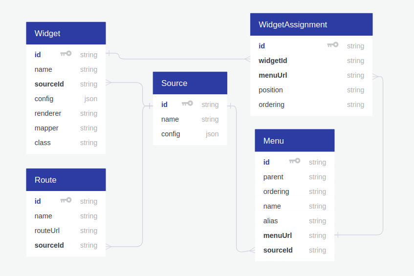

# Unite Framework (v2)

## Prerequisite

- Node, NPM, loopback-v3 (nodejs framework) and MongoDB should be installed on the system.
 
## Setup on localhost

1. **Clone** - Clone this repo 
2. **Install server dependencies** - change directory to the server folder and run ```npm install``` command. This will install all the server dependencies.
3. **Verify MongoDB is active** - MongoDB is by default not started every time the system is restarted / booted. Verify MongoDB server is active/running with command ```service mongod status```. If not active, start the MongoDB with command ```sudo service mongod start```.
4. **Import temporary data** - [Instructions](#import-dummy-data-to-start-with)
4. **Start loopback server** - run command ```node .``` to start the server.
5. Once the server is active, one can access ```http://localhost:3002/explorer``` URL to add application data (Such as Menu, Widget, WidgetAssignment, Source) using post service from loopback. refer Database Design Diagram for more clarification on relationship between the collections.
6. **Install Angular dependencies** - Next, change directory to the web folder and run ```npm install``` command to install the Angular dependencies.
7. **Start Angular application** - run command ```ng serve --open``` and check running application on ```http://localhost:4200```.

## Unite Documentation Link

-  link - https://docs.google.com/document/d/1cin9yFF5QIiw02xFJVsFWsmwnbd5cHSquZ-HUIuxzDQ/edit?usp=sharing

## Database Design Diagram

-  link - <a href="https://app.quickdatabasediagrams.com/#/schema/kgDNgaLMYESb-suRwpJeGw" target="_blank">Database design</a>



## Misc

- [MongoDB Compass](https://www.mongodb.com/products/compass) - Something similar to phpMyAdmin but is for MongoDB.

## Import dummy data to start with

- Open terminal in directory (unite-framework/temp-data/sunbird) and execute the following commands.

```
sudo mongoimport --db umongodb --collection Menu --file menu.json
sudo mongoimport --db umongodb --collection Widget --file widget.json
sudo mongoimport --db umongodb --collection Source --file source.json
sudo mongoimport --db umongodb --collection WidgetAssignment --file widgetassignment.json
sudo mongoimport --db umongodb --collection Route --file route.json
```
- Above commands will import the collections ```Menu, Widget, Source, WidgetAssignment and Route``` inside the ```umongodb``` database, which can be verified with the ```Compass explorer```.